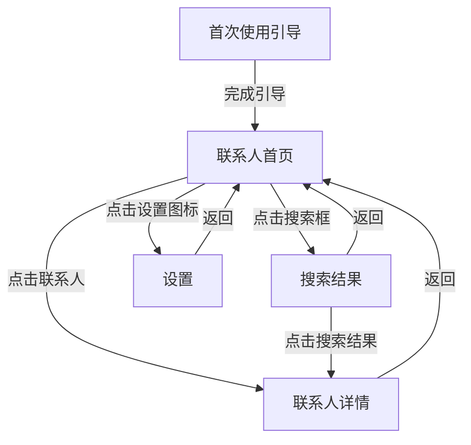
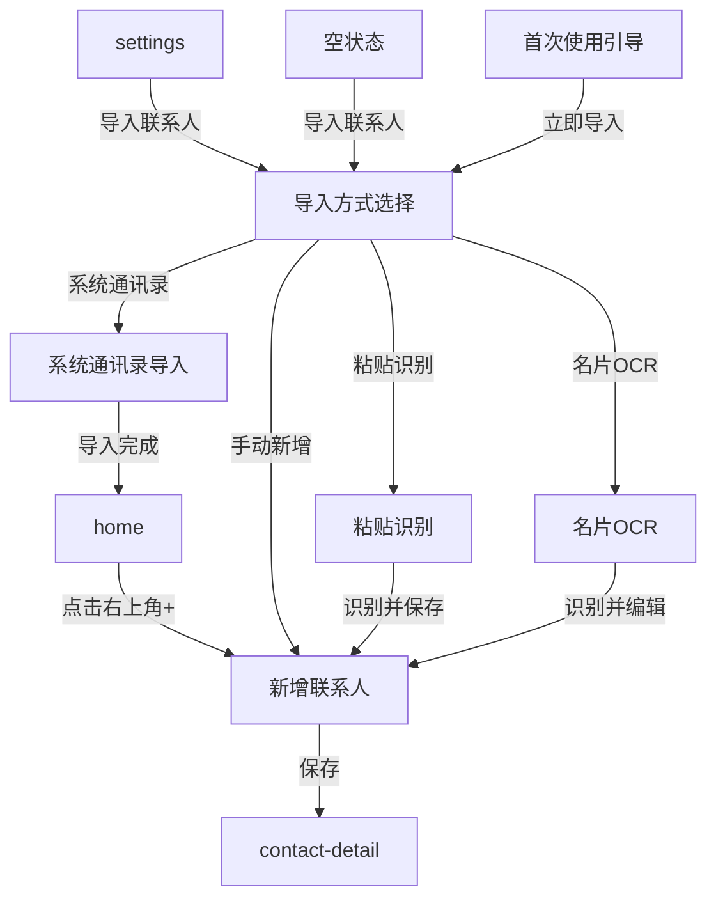
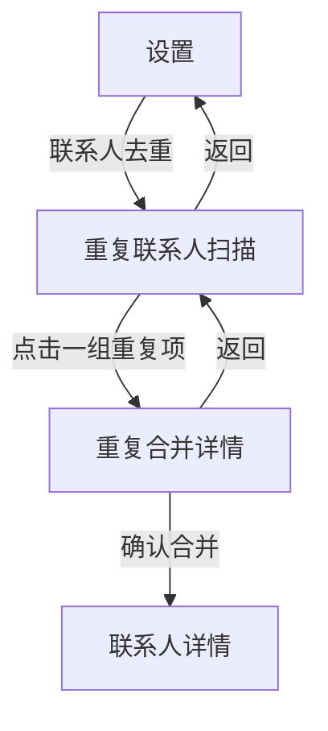
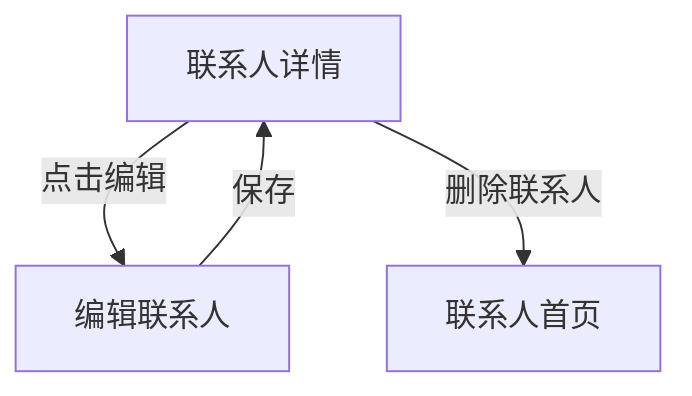
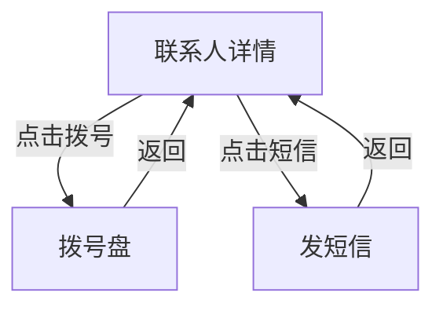
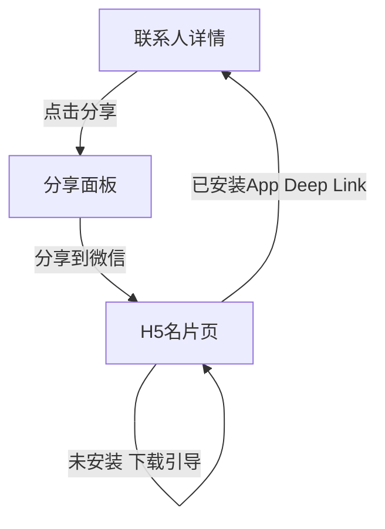

# 业务流程

## 主流程一：联系人浏览与查找

## 主流程二：新增与导入联系人

## 主流程三：智能排重与合并

## 主流程四：联系人编辑与删除

## 主流程五：拨号与发短信

## 主流程六：名片分享与 Deep Link

## 跳转关系表

| 源页面 | 触发元素 | 目标页面 | 条件 |
|---|---|---|---|
| `onboarding` | 「开始使用」按钮 | `home` | — |
| `onboarding` | 「立即导入联系人」按钮 | `import` | — |
| `home` | 搜索框 | `search` | — |
| `home` | 联系人列表项 | `contact-detail` | 非李明 |
| `home` | 联系人列表项（李明） | `contact-detail-multi` | — |
| `home` | 最近联系人卡片 | `contact-detail` | — |
| `home` | 右上角「设置」图标 | `settings` | — |
| `home` | 右下角「+」按钮 | `contact-add` | — |
| `home` | 空状态「导入联系人」 | `import` | 0 条联系人 |
| `contact-detail` | 左上方「返回」 | `home` | — |
| `contact-detail` | 「编辑」按钮 | `contact-edit` | — |
| `contact-detail` | 「分享」按钮 | `share-sheet` | — |
| `contact-add` | 「保存」按钮 | `contact-detail` | — |
| `contact-add` | 「取消」按钮 | `home` | — |
| `contact-edit` | 「保存」按钮 | `contact-detail` | — |
| `contact-edit` | 「取消」按钮 | `contact-detail` | — |
| `search` | 搜索结果项 | `contact-detail` | — |
| `search` | 「取消」按钮 | `home` | — |
| `settings` | 「导入联系人」 | `import` | — |
| `settings` | 「联系人去重」 | `duplicate-scan` | — |
| `settings` | 「返回」 | `home` | — |
| `import` | 「系统通讯录」 | `import-system` | — |
| `import` | 「粘贴识别」 | `import-paste` | — |
| `import` | 「名片 OCR」 | `import-ocr` | — |
| `import` | 「手动新增」 | `contact-add` | — |
| `import` | 「返回」 | `settings` | — |
| `import-system` | 导入完成 | `home` | — |
| `import-paste` | 「识别并保存」 | `contact-add` | — |
| `import-paste` | 「返回」 | `import` | — |
| `import-ocr` | 「识别并编辑」 | `contact-add` | — |
| `import-ocr` | 「返回」 | `import` | — |
| `duplicate-scan` | 一组重复项 | `duplicate-merge` | — |
| `duplicate-scan` | 「返回」 | `settings` | — |
| `duplicate-merge` | 「确认合并」 | `contact-detail` | — |
| `duplicate-merge` | 「返回」 | `duplicate-scan` | — |
| `share-sheet` | 「微信」 | `h5-card` | — |
| `share-sheet` | 「取消」 | `contact-detail` | — |
| `h5-card` | 「打开 App 查看」 | `contact-detail` | 已安装 App |
| `h5-card` | 「下载 App」 | `h5-card` | 未安装 App |
| `empty-state` | 「导入联系人」 | `import` | — |
| `empty-state` | 「手动添加」 | `contact-add` | — |
| `contact-detail` | 「拨号」按钮 | `dial-pad` | — |
| `contact-detail` | 「短信」按钮 | `sms-compose` | — |
| `dial-pad` | 「返回」 | `contact-detail` | — |
| `sms-compose` | 「返回」 | `contact-detail` | — |
